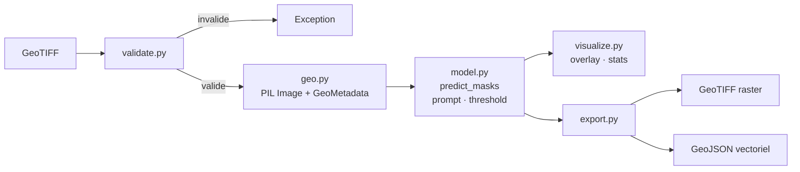

# geo-sam3-lab

Librairie d'inférence SAM3 pour l'imagerie géospatiale (ortho, satellite, aérien).  
Entrée : GeoTIFF. Sortie : masques de segmentation + couche raster géoréférencée.

---

## Structure

```
geo-sam3-lab/
│
├── geo_sam3_inference/       # Librairie
│   ├── __init__.py           # API publique + config logging
│   ├── download.py           # Login HuggingFace + téléchargement modèle
│   ├── validate.py           # Validation : GeoTIFF requis, CRS présent, taille 512
│   ├── model.py              # Sam3InferenceEngine
│   ├── geo.py                # GeoImageReader, GeoMetadata
│   ├── visualize.py          # draw_overlay, draw_contours, compute_stats
│   └── export.py             # export_geotiff, export_geojson
│
├── tests/
│   ├── conftest.py           # Fixtures partagées (GeoTIFF factice, masque, GeoMetadata)
│   ├── unit/
│   │   ├── test_validate.py
│   │   ├── test_geo.py
│   │   ├── test_visualize.py
│   │   └── test_export.py
│   └── functional/
│       └── test_pipeline.py  # GeoTIFF → lecture → export, modèle mocké
│
├── use_cases/
│   └── pedestrian_crossing/
│       ├── README.md         # Description, résultats attendus, métriques
│       ├── notebook.ipynb    # Démo interactive : code + visuels inline
│       └── demo_img/         # Images GeoTIFF de test
│
├── .env.example
├── LICENSE
└── pyproject.toml
```

---

## Flux et utilisation

> **Prérequis données** : conçu pour l'orthophoto IGN 2024 (BD ORTHO® HR, 20 cm/pixel en urbain). Les images doivent être des GeoTIFF géoréférencés découpés en tuiles de 512 x 512 px avant inférence.

Chaque tuile passe par une validation stricte, seuls les GeoTIFF avec CRS sont acceptés.



---

4 lignes suffisent pour lancer une inférence sur n'importe quel use case.

```python
from geo_sam3_inference.validate import validate_geotiff
from geo_sam3_inference.geo import GeoImageReader
from geo_sam3_inference.model import Sam3InferenceEngine
from geo_sam3_inference.export import export_geotiff

validate_geotiff("input.tif")
image, geo_meta = GeoImageReader.read("input.tif")
masks = Sam3InferenceEngine().predict_masks(image, "your prompt", threshold=0.35)
export_geotiff(masks, geo_meta, "output/result.tif")
```

---

## Use cases

Chaque use case est un dossier autonome avec sa config (prompt, seuils), ses images de test et son script d'inférence. La librairie ne change pas seul le prompt et les paramètres varient.

| # | Nom | Description | Doc |
|---|---|---|---|
| 1 | Passages piétons | Détection de zebra crossing sur ortho urbaine | [→ doc](use_cases/pedestrian_crossing/README.md) |

---

## Dépendances

`transformers` · `torch` · `rasterio` · `pillow` · `numpy` · `huggingface_hub` · `python-dotenv`
