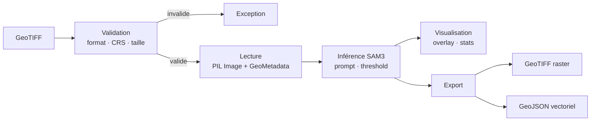
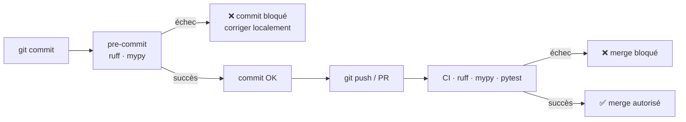
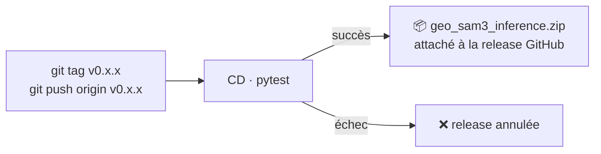

# geo-sam3-lab

Librairie d'inférence SAM3 pour l'imagerie géospatiale (ortho, satellite, aérien).  
Entrée : GeoTIFF. Sortie : masques de segmentation + couche raster géoréférencée.

---

## Comment ça fonctionne

Les images doivent être des GeoTIFF géoréférencés (CRS obligatoire), découpés en tuiles de 512 × 512 px. Chaque tuile passe par une validation stricte avant inférence.



> Conçu pour l'orthophoto IGN 2024 (BD ORTHO® HR, 20 cm/pixel en urbain).

## Utilisation

```python
from geo_sam3_inference.validate import validate_geotiff
from geo_sam3_inference.geo import GeoImageReader
from geo_sam3_inference.model import Sam3InferenceEngine
from geo_sam3_inference.export import export_geotiff

validate_geotiff("input.tif")
image, geo_meta = GeoImageReader.read("input.tif")
masks = Sam3InferenceEngine().predict_masks(image, "your prompt", threshold=0.35)
export_geotiff(masks, geo_meta, "output/result.tif")
```

## Use cases

Chaque use case est autonome — seuls le prompt et les paramètres varient, la librairie ne change pas.

| # | Nom | Description | Doc |
|---|---|---|---|
| 1 | Passages piétons | Détection de zebra crossing sur ortho urbaine | [→ doc](use_cases/pedestrian_crossing/README.md) |

## Dépendances

`transformers` · `torch` · `rasterio` · `pillow` · `numpy` · `huggingface_hub` · `python-dotenv`

---

## Pour les contributeurs

### Structure

```
geo-sam3-lab/
│
├── geo_sam3_inference/       # Librairie
│   ├── __init__.py           # API publique + config logging
│   ├── download.py           # Login HuggingFace + téléchargement modèle
│   ├── validate.py           # Validation : GeoTIFF requis, CRS présent, taille 512
│   ├── model.py              # Sam3InferenceEngine
│   ├── geo.py                # GeoImageReader, GeoMetadata
│   ├── visualize.py          # draw_overlay, draw_contours, compute_stats
│   └── export.py             # export_geotiff, export_geojson
│
├── tests/
│   ├── conftest.py           # Fixtures partagées
│   ├── unit/
│   └── functional/
│       └── test_pipeline.py  # GeoTIFF → lecture → export, modèle mocké
│
├── use_cases/
│   └── pedestrian_crossing/
│       ├── README.md
│       ├── notebook.ipynb
│       └── demo_img/
│
├── .github/workflows/        # CI (tests + lint) · CD (release)
├── .pre-commit-config.yaml
└── pyproject.toml
```

### Démarrer

```bash
git clone https://github.com/mandresyandri/geo-sam3-lab
cd geo-sam3-lab
pip install -e ".[dev]"
pre-commit install            # installe les hooks locaux (une seule fois)
```

### Pipeline qualité



| Outil | Rôle | Moment |
|---|---|---|
| `ruff` | Linting + formatage | pre-commit + CI |
| `mypy` | Vérification des types | pre-commit + CI |
| `pytest` | Tests | CI uniquement |

```bash
pre-commit run --all-files    # vérifier sans commiter
pytest                        # vérifier les tests avant d'ouvrir une PR
```

### Releases

Les releases sont sous la responsabilité des mainteneurs. Un `git push` normal ne crée jamais de release.



Le ZIP est utilisé dans les notebooks Colab / ArcGIS pour charger la librairie sans installation.