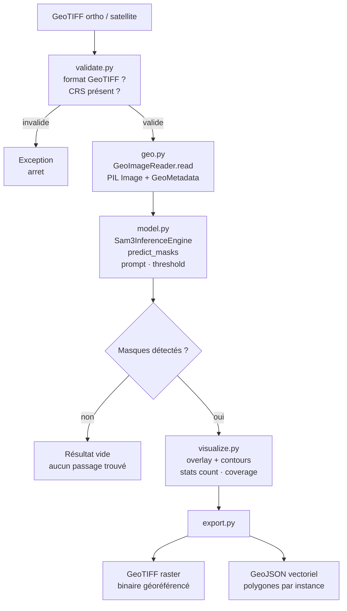

# Use case — Détection de passages piétons

Segmentation zero-shot de passages piétons (zebra crossing) sur orthophoto IGN 2024.

---

## Flux de prédiction



---

## Lancer

```bash
jupyter lab notebook.ipynb
```

---

## Sorties

```
output/
├── pedestrian_crossings.tif      # raster binaire géoréférencé (EPSG:2154)
├── pedestrian_crossings.geojson  # polygones vectoriels par instance
└── visualization.png             # overlay pour vérification visuelle
```

Le GeoTIFF exporté conserve exactement le CRS et la transform de l'image d'entrée — il s'ouvre directement dans QGIS superposé à l'ortho source.

---

## Résultats attendus

| Métrique | Valeur typique |
|---|---|
| Passages détectés par tuile | 0 à 3 |
| Couverture moyenne | 2 à 8% |
| Faux positifs fréquents | Marquages au sol, bandes de stationnement |

Les faux positifs diminuent en abaissant `THRESHOLD` (défaut `0.35`) ou en affinant le prompt (`"zebra crossing"` plutôt que `"pedestrian crossing"`).

---

## Librairie utilisée

[geo_sam3_inference/](../../geo_sam3_inference/)
